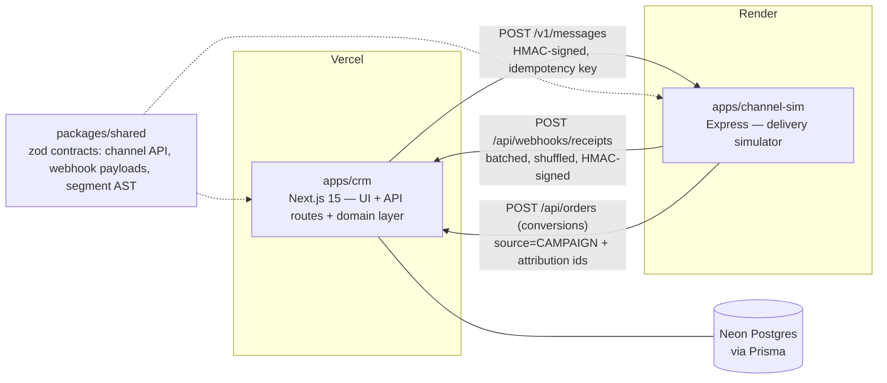

# Architecture

> Phase 0 snapshot — this document grows with each phase and is finalized in Phase 7.

Resonate is two deployable services plus a shared contract package:

Key properties (built out across phases):

- **Contract-first**: both services validate every boundary with the same zod schemas from `packages/shared`. A drift fails loudly on either side.
- **Receipts are hostile by design**: the simulator batches, shuffles, and may replay receipt events. The CRM survives via an append-only `ReceiptEvent` ledger (unique `(vendorMessageId, eventType)`) and a forward-only status state machine.
- **One domain layer, thin routes**: API route handlers parse/validate and delegate to `apps/crm/src/server/*`. The same functions will back the optional AI copilot.
